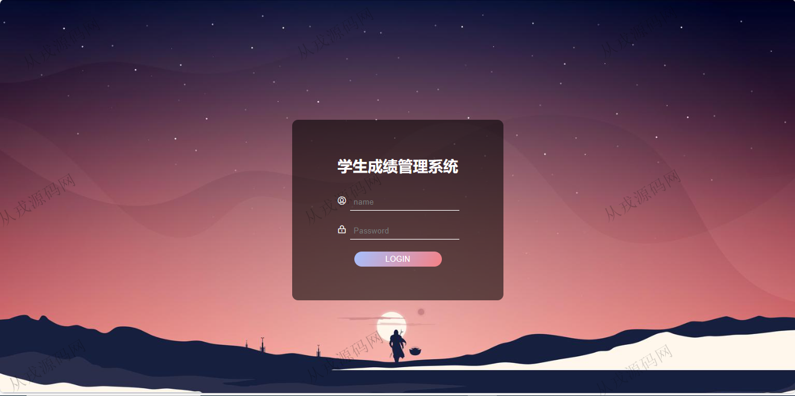

<h1 align="center">93.学生成绩管理系统</h1>

 获取sql文件 QQ: 386869957 QQ群: 377586148 

 [推荐站点: 从戎源码网](https://armycodes.com/) 

## 简介

> 本代码来源于网络,仅供学习参考使用!
>
> 提供1.远程部署/2.修改代码/3.设计文档指导/4.框架代码讲解等服务
> 
> 登录地址：http://localhost:8080/jsp/login.jsp
> 
> 用户名密码：admin 123456
>

## 项目介绍
基于ssm的学生成绩管理系统：前端 jsp、jquery、bootstrap，后端 springmvc、spring、mybatis，角色分为管理员；集成学生信息、课程信息、成绩信息等功能于一体的系统。

## 功能介绍

- 学生信息：学生信息的增删改查，根据学号搜索查询，批量删除
- 课程信息：课程信息的增删改查，根据课程号搜索查询，批量删除
- 成绩信息：成绩信息的增删改查，根据学号搜索成绩，批量删除

## 环境

- <b>IntelliJ IDEA 2021.3</b>

- <b>Mysql 5.7.26</b>

- <b>Tomcat 7.0.73</b>

- <b>JDK 1.8</b>

## 运行截图

